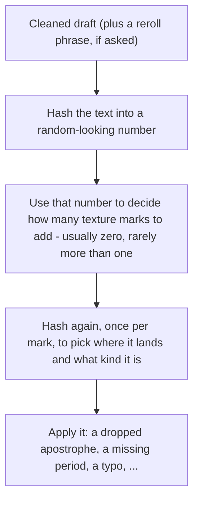

# unpolish

Strip machine polish from prose, then (on forum/chat/social) add sparse hash-drawn texture. One action: **unpolish**. Not a detector bypass or a typo factory.

```
draft → register → strip slop → second-pass audit → texture (if allowed) → deliver
```

Texture expected rate: **λ ≈ words / 600** (floor 0.05). Often zero. No hard cap.

## Usage

Say **unpolish**. No flags.

| You | It |
| --- | --- |
| Paste a draft | Returns four sections: audit, rewrite, changes, second pass |
| “Edit `draft.md` in place” | Edits that prose file; leaves code, tables, quotes alone |
| Name a file without asking to edit | Proposes a rewrite; does not touch the file |

Overrides, in plain language: “for Reddit,” “no texture,” “add texture,” “reroll.”

## Quick demo

**Input** (register inferred as `forum`):

> I want to lay out the full situation before asking for judgment. My roommate and I have lived together for two years, and lately there's been a recurring conflict around shared chores — specifically the dishes, the trash, and general cleanliness of our shared spaces. It's not really about the dishes, it's about respect, and it's not really about respect either, it's about a fundamental imbalance that's been quietly building for months.
>
> She works long hours, and I genuinely empathize with how exhausting that can be. However, roommate experts generally agree that unequal distribution of labor in shared households is one of the leading causes of relationship strain. At the end of the day, a home serves as a shared responsibility, not a hotel room that resets itself every morning.
>
> Last week, I finally addressed it directly. I told her the current arrangement wasn't sustainable, and that I needed her to actually follow through on the chore schedule we'd agreed on. She got defensive, said I was being dramatic, and pointed out that she pays slightly more in rent. I said the extra fifty dollars a month doesn't buy her out of basic cleanliness. Moreover, I've been picking up the slack for months without complaint.
>
> Now she's telling mutual friends that I ambushed her and that I'm being controlling about a few dirty dishes. In conclusion, I don't think I'm the one being unreasonable here, but I wanted outside perspective. AITA?

**Output:**

> My roommate and I have lived together for two years, and lately we keep fighting about chores: dishes, trash, keeping the shared spaces basically clean.
>
> She works long hours and thats exhausting, I get it. But splitting chores unevenly is a common way roommate situations go bad, and living together only works if we both actually do our part.
>
> Last week I brought it up directly. I told her the current setup wasn't working and that I needed her to stick to the chore schedule we'd agreed on. She got defensive, said I was being dramatic, and pointed out she pays slightly more in rent. I said an extra fifty dollars a month doesn't cover basic cleanliness. I've also been picking up the slack for months without saying anything.
>
> Now she's telling mutual friends I ambushed her and that I'm being controlling about a few dirty dishes. I don't think I'm the unreasonable one here, but I wanted an outside read. AITA?

**What it caught:** reasoning leak (“I want to lay out the full situation before asking for judgment”), a stacked Not-X-it’s-Y negation (“It’s not really about the dishes, it’s about respect, and it’s not really about respect either…”), an em dash, magic adverbs (“genuinely,” “quietly”), vague attribution (“roommate experts generally agree”), copula dodge (“serves as”), two signposted wrap-ups (“At the end of the day,” “In conclusion”), and a filler transition (“Moreover”). 8 tells across all three buckets.

**Texture:** register `forum` → texture runs. This 162-word stripped draft has λ ≈ 0.27 (mostly rolls 0). This roll drew `k = 1`: `texture: dropped_apostrophe (that's → thats), paragraph 2`. Re-run the same text without a reroll and it’s usually `k = 0` — this is a representative hit, not the typical outcome.

Full theme catalog and word-replacement tables: [`SKILL.md`](./SKILL.md), [`reference.md`](./reference.md).

## Texture hash

Same stripped draft → same rolls. “Reroll” adds an internal phrase as salt. Agents never take hash parameters from the user.



Count examples: ~20 words → almost always 0; ~600 words → mix of 0/1/2; ~1000 words → commonly 1–2.

Checked fixtures: [`reference.md`](./reference.md).

## Install

Open this repo in Claude Code or Cursor. The skill is [`SKILL.md`](./SKILL.md) plus [`reference.md`](./reference.md).

```bash
# Claude Code
mkdir -p ~/.claude/skills/unpolish
cp SKILL.md reference.md ~/.claude/skills/unpolish/

# Cursor
mkdir -p ~/.cursor/skills/unpolish
cp SKILL.md reference.md ~/.cursor/skills/unpolish/
```

## Credits

Pattern research informed by:

- Caroline Tagg, *“i didn’t spel that wrong did i. Oops”* — SMS/CMC spelling variation: apostrophe omission is common and often deliberate; genuine mistypes are rare ([Lancaster ePrints](https://eprints.lancs.ac.uk/id/eprint/60484/))
- Harris & Hiltunen — YouTube/9GAG comments: apostrophe omission and nonstandard caps as register, not error
- Dhakal, Feit, Kristensson, Oulasvirta, CHI 2018 — [136M keystrokes analysis](https://userinterfaces.aalto.fi/136Mkeystrokes/resources/chi-18-analysis.pdf): substitution vs. insertion in raw typing
- [Language Log](https://languagelog.ldc.upenn.edu/nll/?p=73591) — “how to spell” lookup lists aren’t the same as what survives in unedited text (`alot`, `could of`, `its`/`it's`)
- [Grammarly](https://www.grammarly.com/blog/commonly-confused-words/would-of-could-of-should-of/) and [Canada.ca Writing Tips](https://our-languages.canada.ca/en/writing-tips-plus/could-have-couldve-could-of) — `could of` as heard `could've`
- Residual misspelling rate on published social text is often cited around ~0.2–0.6% of words — background for how rare texture should be, not a literal conversion
- [avoid-ai-writing](https://github.com/conorbronsdon/avoid-ai-writing) — word-replacement tiering and second-pass audit structure
- [humanizer](https://github.com/blader/humanizer) — portable single-file skill format this repo follows

## License

MIT — see [LICENSE](./LICENSE).
