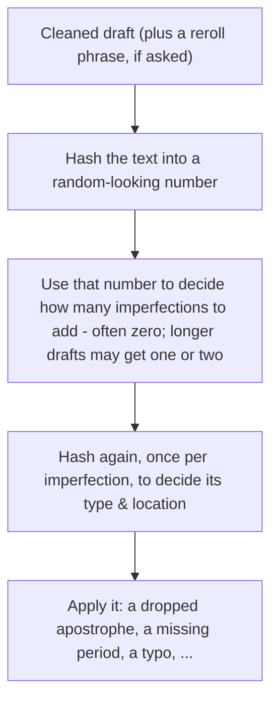

# unpolish-ai-writing

Removes signs of AI-generated writing from text using up to two methods:

- Detect, remove, and replace common signs of AI writing 
- Optionally adds sparse typing errors informed by researched human error patterns.

## How it works

Step 1 (Default): AI detection & cleanup

- Detect common AI writing patterns as documented by ["Signs of AI writing"](https://en.wikipedia.org/wiki/Wikipedia:Signs_of_AI_writing) as well as tropes.fyi and other sources (view NOTES.md for more info)

Step 2 (Optional): introduce human-like writing errors

- The size of the text determines the average number of expected imperfections (via a Poisson distribution). 
- The SHA-256 hash of a seed built from the text simulates an individual trial given the distribution. 
- If the trial returns a non-zero imperfection count, hash again with a different seed to determine the imperfection type (missing punctuation, misspelling, etc) and the placement of the imperfection within the text.


## Usage

Invoke the skill however your agent harness exposes installed skills. Common forms include a slash command or a direct request:

```
/unpolish-ai-writing

[paste your text here]
```

```
Please unpolish this text: [your text]
```

Point it at a file and the skill rewrites it in place:

```
Unpolish the prose in docs/launch-post.md
```

To add typing errors:

```
Unpolish this and add imperfections: [your text]
```


## Full example

**Input:**

> The barbers are incredibly skilled, attentive to detail, and actually take the time to understand exactly what you’re after. My son’s haircut was sharp, clean, and done with precision—easily one of the best he’s ever gotten. They don’t rush appointments, and you can tell they take pride in their work.
>
> The shop itself is clean, stylish, and welcoming. It’s clear they care about creating a great experience from start to finish. Whether you’re in for a quick trim or a full grooming session, you’re in great hands here.
>
> Highly recommend this place to anyone looking for top-quality service and a fresh, confident look every time. I won’t be going anywhere else!

**Output** (strip + imperfections):

> The barbers listen to what you're after and they don't rush. my son's haircut was sharp and clean, one of the best he's gotten. You can tell they take pride in the work.
>
> The shop is clean and easy to walk into. Quick trim or a longer appointment, both are fine.
>
> I won't be going anywhere else.

**What it caught:**

- Stacked rule-of-three beats (“incredibly skilled, attentive to detail, and actually take the time…”, “sharp, clean, and done with precision”, “clean, stylish, and welcoming”)
- Em dash
- Empty experience padding (“from start to finish”, “you’re in great hands”)
- Signposted wrap-up (“Highly recommend… top-quality service…”)

**Imperfections:** `uncapitalized_start (The → the) @ sentence 1`


## Optional typing errors

Same cleaned input always gets the same typos. “Reroll” changes the seed so you get a different set. About one slip per 600 words, and often none.




Count examples: ~20 words → almost always 0; ~600 words → mix of 0/1/2; ~1000 words → commonly 1–2.

Details: `[references/imperfections.md](./references/imperfections.md)`.

## Install

Open this repo in Claude Code or Cursor. The skill is `[SKILL.md](./SKILL.md)` plus `[references/](./references/)` (typing-error recipe, loaded only when asked).

```bash
# Claude Code
mkdir -p ~/.claude/skills/unpolish-ai-writing/references
cp SKILL.md ~/.claude/skills/unpolish-ai-writing/
cp -R references ~/.claude/skills/unpolish-ai-writing/

# Cursor
mkdir -p ~/.cursor/skills/unpolish-ai-writing/references
cp SKILL.md ~/.cursor/skills/unpolish-ai-writing/
cp -R references ~/.cursor/skills/unpolish-ai-writing/
```


## Credits

Pattern research informed by [avoid-ai-writing](https://github.com/conorbronsdon/avoid-ai-writing) and [humanizer](https://github.com/blader/humanizer). Sources for a few extra tells and the typing-error rate are in NOTES.md

## License

MIT — see [LICENSE](./LICENSE).