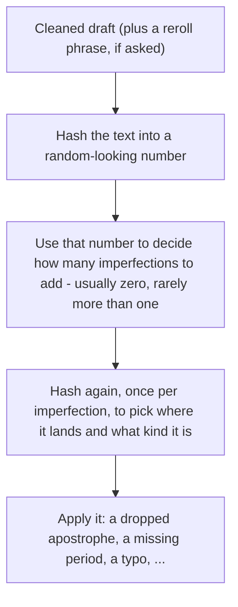

# unpolish-ai-writing

Strip machine polish from prose. One action: **unpolish**. Add sparse hash-drawn imperfections **only when asked**. Not a detector bypass or a typo factory.

```
draft → strip slop → second-pass audit → imperfections (if asked) → deliver
```

Imperfections expected rate (when on): **λ ≈ words / 600** (floor 0.05). Often zero. No hard cap.

## Usage

Say **unpolish**. No flags.

| You | It |
| --- | --- |
| Paste a draft | Returns four sections: audit, rewrite, changes, second pass |
| “Edit `draft.md` in place” | Edits that prose file; leaves code, tables, quotes alone |
| Name a file without asking to edit | Proposes a rewrite; does not touch the file |

Overrides, in plain language: “add imperfections,” “reroll.”

## Quick demo

**Input:**

> I want to lay out the full situation before asking for judgment. My roommate and I have lived together for two years, and lately there's been a recurring conflict around shared chores — specifically the dishes, the trash, and general cleanliness of our shared spaces. It's not really about the dishes, it's about respect, and it's not really about respect either, it's about a fundamental imbalance that's been quietly building for months.
>
> She works long hours, and I genuinely empathize with how exhausting that can be. However, roommate experts generally agree that unequal distribution of labor in shared households is one of the leading causes of relationship strain. At the end of the day, a home serves as a shared responsibility, not a hotel room that resets itself every morning.
>
> Last week, I finally addressed it directly. I told her the current arrangement wasn't sustainable, and that I needed her to actually follow through on the chore schedule we'd agreed on. She got defensive, said I was being dramatic, and pointed out that she pays slightly more in rent. I said the extra fifty dollars a month doesn't buy her out of basic cleanliness. Moreover, I've been picking up the slack for months without complaint.
>
> Now she's telling mutual friends that I ambushed her and that I'm being controlling about a few dirty dishes. In conclusion, I don't think I'm the one being unreasonable here, but I wanted outside perspective. AITA?

**Output** (strip only — no imperfections asked):

> My roommate and I have lived together for two years, and lately we keep fighting about chores: dishes, trash, keeping the shared spaces basically clean.
>
> She works long hours and that's exhausting, I get it. But splitting chores unevenly is a common way roommate situations go bad, and living together only works if we both actually do our part.
>
> Last week I brought it up directly. I told her the current setup wasn't working and that I needed her to stick to the chore schedule we'd agreed on. She got defensive, said I was being dramatic, and pointed out she pays slightly more in rent. I said an extra fifty dollars a month doesn't cover basic cleanliness. I've also been picking up the slack for months without saying anything.
>
> Now she's telling mutual friends I ambushed her and that I'm being controlling about a few dirty dishes. I don't think I'm the unreasonable one here, but I wanted an outside read. AITA?

**What it caught:** reasoning leak (“I want to lay out the full situation before asking for judgment”), a stacked Not-X-it’s-Y negation (“It’s not really about the dishes, it’s about respect, and it’s not really about respect either…”), an em dash, magic adverbs (“genuinely,” “quietly”), vague attribution (“roommate experts generally agree”), copula dodge (“serves as”), two signposted wrap-ups (“At the end of the day,” “In conclusion”), and a filler transition (“Moreover”). 8 tells across all three buckets.

**Imperfections:** off unless the user asks. Say “add imperfections” / “reroll” to run the hash recipe in [`references/imperfections.md`](./references/imperfections.md).

Strip rules and word tables: [`SKILL.md`](./SKILL.md).

## Imperfections hash

Same stripped draft → same rolls. “Reroll” adds an internal phrase as salt. Agents never take hash parameters from the user.



Count examples: ~20 words → almost always 0; ~600 words → mix of 0/1/2; ~1000 words → commonly 1–2.

Checked fixtures: [`references/imperfections.md`](./references/imperfections.md).

## Install

Open this repo in Claude Code or Cursor. The skill is [`SKILL.md`](./SKILL.md) plus [`references/`](./references/) (imperfections recipe, loaded only when asked).

```bash
# Claude Code
mkdir -p ~/.claude/skills/unpolish/references
cp SKILL.md ~/.claude/skills/unpolish/
cp -R references ~/.claude/skills/unpolish/

# Cursor
mkdir -p ~/.cursor/skills/unpolish/references
cp SKILL.md ~/.cursor/skills/unpolish/
cp -R references ~/.cursor/skills/unpolish/
```

## Credits

Pattern research informed by [avoid-ai-writing](https://github.com/conorbronsdon/avoid-ai-writing) and [humanizer](https://github.com/blader/humanizer). Imperfection-rate background and source citations: [`NOTES.md`](./NOTES.md) (not part of the skill runtime).

## License

MIT — see [LICENSE](./LICENSE).
