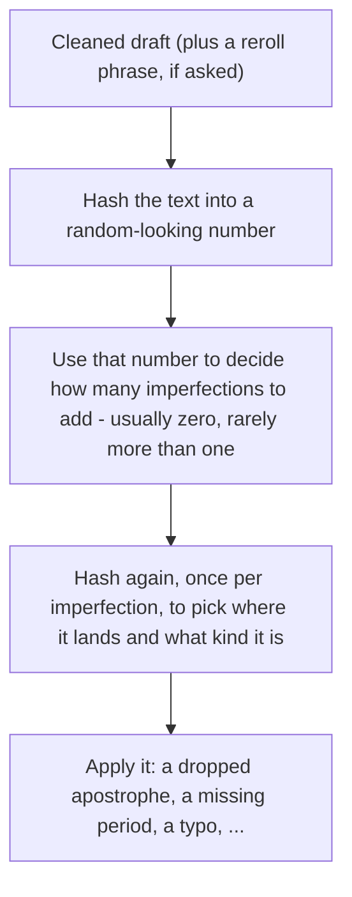

# unpolish-ai-writing

Removes signs of AI-generated writing from text, and **optionally** adds sparse typing errors informed by researched human error patterns.


## How it works

Step 1: AI detection & cleanup

- Detect common AI writing patterns as documented by ["Signs of AI writing"](https://en.wikipedia.org/wiki/Wikipedia:Signs_of_AI_writing) as well as tropes.fyi and other sources (view NOTES.md for more info)


Step 2 (Optional): introduce human-like writing errors

- The size of the text determines the average number of expected imperfections (via a Poisson distrubtion). The typo/imperfection rate is estimated based on logged human text output.

- The SHA-256 hash of the text simulates an individual trial given the distribution. 

- If the trial returns an imperfection count of at least 1, salt to re-roll a second SHA-256 hash output.

- The second output is used for a weighted cumulative distribution function to return an imperfection type (missing punctuation, misspelling, etc), subtype, and the placement of the imperfection within the text.


## Usage

Invoke the skill however your agent harness exposes installed skills. Common forms include a slash command or a direct request:

```
/unpolish-ai-writing

[paste your text here]
```

```
Please unpolish this text: [your text]
```

Point it at a file and the skill rewrites it in place:

```
Unpolish the prose in docs/launch-post.md
```

To add typing errors:

```
Unpolish this and add imperfections: [your text]
```

## Quick demo

**Input:**

> I want to lay out the full situation before asking for judgment. My roommate and I have lived together for two years, and lately there's been a recurring conflict around shared chores — specifically the dishes, the trash, and general cleanliness of our shared spaces. It's not really about the dishes, it's about respect, and it's not really about respect either, it's about a fundamental imbalance that's been quietly building for months.
>
> She works long hours, and I genuinely empathize with how exhausting that can be. However, roommate experts generally agree that unequal distribution of labor in shared households is one of the leading causes of relationship strain. At the end of the day, a home serves as a shared responsibility, not a hotel room that resets itself every morning.
>
> Last week, I finally addressed it directly. I told her the current arrangement wasn't sustainable, and that I needed her to actually follow through on the chore schedule we'd agreed on. She got defensive, said I was being dramatic, and pointed out that she pays slightly more in rent. I said the extra fifty dollars a month doesn't buy her out of basic cleanliness. Moreover, I've been picking up the slack for months without complaint.
>
> Now she's telling mutual friends that I ambushed her and that I'm being controlling about a few dirty dishes. In conclusion, I don't think I'm the one being unreasonable here, but I wanted outside perspective. AITA?

**Output** (strip only — no typing errors asked):

> My roommate and I have lived together for two years, and lately we keep fighting about chores: dishes, trash, keeping the shared spaces basically clean.
>
> She works long hours and that's exhausting, I get it. But splitting chores unevenly is a common way roommate situations go bad, and living together only works if we both actually do our part.
>
> Last week I brought it up directly. I told her the current setup wasn't working and that I needed her to stick to the chore schedule we'd agreed on. She got defensive, said I was being dramatic, and pointed out she pays slightly more in rent. I said an extra fifty dollars a month doesn't cover basic cleanliness. I've also been picking up the slack for months without saying anything.
>
> Now she's telling mutual friends I ambushed her and that I'm being controlling about a few dirty dishes. I don't think I'm the unreasonable one here, but I wanted an outside read. AITA?

**What it caught:** reasoning leak (“I want to lay out the full situation before asking for judgment”), a stacked Not-X-it’s-Y negation (“It’s not really about the dishes, it’s about respect, and it’s not really about respect either…”), an em dash, magic adverbs (“genuinely,” “quietly”), vague attribution (“roommate experts generally agree”), copula dodge (“serves as”), two signposted wrap-ups (“At the end of the day,” “In conclusion”), and a filler transition (“Moreover”). 8 tells across all three buckets.

**Typing errors:** off unless you ask. Say “add imperfections” or “reroll.” The recipe is in [`references/imperfections.md`](./references/imperfections.md).

Strip rules and word tables: [`SKILL.md`](./SKILL.md).

## Optional typing errors

Same cleaned input always gets the same typos. “Reroll” changes the seed so you get a different set. About one slip per 600 words, and often none.



Count examples: ~20 words → almost always 0; ~600 words → mix of 0/1/2; ~1000 words → commonly 1–2.

Details and checked examples: [`references/imperfections.md`](./references/imperfections.md).

## Install

Open this repo in Claude Code or Cursor. The skill is [`SKILL.md`](./SKILL.md) plus [`references/`](./references/) (typing-error recipe, loaded only when asked).

```bash
# Claude Code
mkdir -p ~/.claude/skills/unpolish-ai-writing/references
cp SKILL.md ~/.claude/skills/unpolish-ai-writing/
cp -R references ~/.claude/skills/unpolish-ai-writing/

# Cursor
mkdir -p ~/.cursor/skills/unpolish-ai-writing/references
cp SKILL.md ~/.cursor/skills/unpolish-ai-writing/
cp -R references ~/.cursor/skills/unpolish-ai-writing/
```

## Credits

Pattern research informed by [avoid-ai-writing](https://github.com/conorbronsdon/avoid-ai-writing) and [humanizer](https://github.com/blader/humanizer). Sources for a few extra tells and the typing-error rate: [`NOTES.md`](./NOTES.md) (not loaded at runtime).

## License

MIT — see [LICENSE](./LICENSE).
