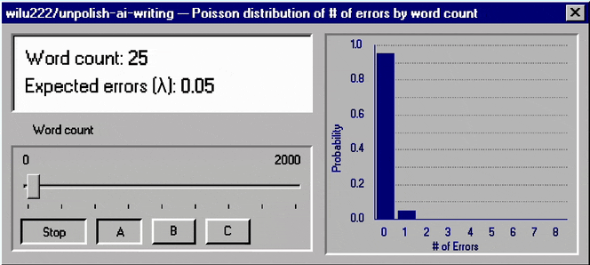
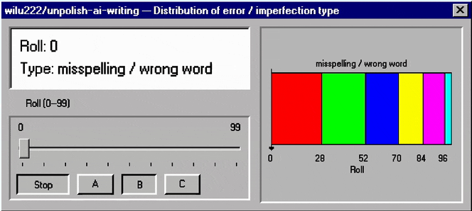

# unpolish-ai-writing

Removes signs of AI-generated writing from text using two methods:

- Detect and remove common signs of AI writing 
- Optionally adds sparse typing errors informed by researched human error patterns.

## How it works

### Step 1 (Default): AI detection & cleanup

- Detect common AI writing patterns (view NOTES.md for more info)

**Selected examples**

| Pattern | Before | After |
| --- | --- | --- |
| Not-X-it's-Y | "It's not just X — it's Y" | State Y directly |
| Rule of three | "skilled, attentive, and precise" | Keep the real details; drop the slogan beat |
| Empty significance / magic adverb | "quietly transformative", "truly special" | Cut, or name what actually changed |
| Invented concept label | "the X paradox/trap/creep" (made-up jargon label) | Plain description, or drop the label |
| Copula dodge | "stands as a testament to…" | "is…" |
| Em-dash habit | "worth it—even with the queue—" | Periods, commas, or a shorter sentence |
| Punchy fragment stack | "Less busywork. More impact. Better focus." | One concrete sentence |

### Step 2 (Optional): human-like writing errors

Same cleaned input always gets the same typos. “Reroll” changes the seed so you get a different set. About one error per 600 words, and often none.

1. Convert the input draft (plus a reroll phrase, if asked) into a hash value
2. Use that number to decide how many imperfections to add (Poisson from word count)



3. If the count is above zero, hash again once per imperfection to pick type and placement, using a weighted distribution



| Type | Example |
| --- | --- |
| Misspelling / wrong word | `could have` → `could of`, `affect` → `effect` |
| Dropped apostrophe | `don't` → `dont`, `I'm` → `Im` |
| Missing end punctuation | last sentence loses its `.` or `?` |
| Uncapitalized sentence start | `The` → `the` |
| Extra space | `I think` → `I  think` |
| Keyboard slip | `the` → `teh`, `should` → `shuild` |


## Usage

Invoke the skill however your agent harness exposes installed skills. Common forms include a slash command or a direct request:

```
/unpolish-ai-writing

[paste your text here]
```

```
Please unpolish this text: [your text]
```

Point it at a file and the skill rewrites it in place:

```
Unpolish the prose in docs/launch-post.md
```

To add typing errors:

```
Unpolish this and add imperfections: [your text]
```


## Full example

**Input:**

> The barbers are incredibly skilled, attentive to detail, and actually take the time to understand exactly what you’re after. My son’s haircut was sharp, clean, and done with precision—easily one of the best he’s ever gotten. They don’t rush appointments, and you can tell they take pride in their work.
>
> The shop itself is clean, stylish, and welcoming. It’s clear they care about creating a great experience from start to finish. Whether you’re in for a quick trim or a full grooming session, you’re in great hands here.
>
> Highly recommend this place to anyone looking for top-quality service and a fresh, confident look every time. I won’t be going anywhere else!

**Output** (strip + imperfections):

> The barbers listen to what you're after and they don't rush. my son's haircut was sharp and clean, one of the best he's gotten. You can tell they take pride in the work.
>
> The shop is clean and easy to walk into. Quick trim or a longer appointment, both are fine.
>
> I won't be going anywhere else.

**What it caught:**

- Stacked rule-of-three beats (“incredibly skilled, attentive to detail, and actually take the time…”, “sharp, clean, and done with precision”, “clean, stylish, and welcoming”)
- Em dash
- Empty experience padding (“from start to finish”, “you’re in great hands”)
- Signposted wrap-up (“Highly recommend… top-quality service…”)

**Imperfections:** `uncapitalized_start (My → my)`


## Install

The skill is `[SKILL.md](./SKILL.md)` plus `[references/](./references/)` (typing-error recipe, loaded only when asked).

### Skills CLI

Install globally with the cross-agent skills CLI:

```bash
npx skills add wilu222/unpolish-ai-writing --global
```

Update an existing install:

```bash
npx skills update unpolish-ai-writing --global
```

Omit `--global` for a project-local install. Start a new agent session or reload skills after installation.

### Claude Code plugin

```
/plugin marketplace add wilu222/unpolish-ai-writing
/plugin install unpolish-ai-writing@unpolish-ai-writing
```

The skill is then invoked as `/unpolish-ai-writing:unpolish-ai-writing`.

### Manual

```bash
# Claude Code
mkdir -p ~/.claude/skills/unpolish-ai-writing/references
cp SKILL.md ~/.claude/skills/unpolish-ai-writing/
cp -R references ~/.claude/skills/unpolish-ai-writing/

# Cursor
mkdir -p ~/.cursor/skills/unpolish-ai-writing/references
cp SKILL.md ~/.cursor/skills/unpolish-ai-writing/
cp -R references ~/.cursor/skills/unpolish-ai-writing/
```


## Credits

Pattern research informed by [avoid-ai-writing](https://github.com/conorbronsdon/avoid-ai-writing) and [humanizer](https://github.com/blader/humanizer). Sources for a few extra tells and the typing-error rate are in NOTES.md

## License

MIT — see [LICENSE](./LICENSE).