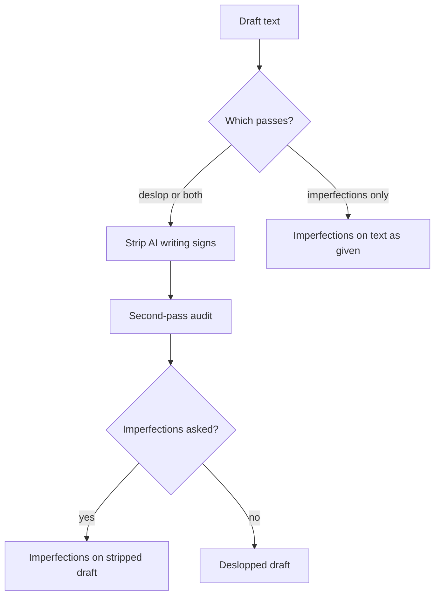

# Unpolish

Two functions: **deslop** (strip AI writing tells) and **imperfections** (sparse hash-drawn typing errors). Default is deslop only. Add imperfections when the user asks. **Imperfections only** skips deslop entirely — draw on the text as given. 

## How to invoke

Infer which passes to run from the request. 

| User says | Run |
| --- | --- |
| `unpolish` / `deslop` /  no extra ask | Strip + second-pass audit. Skip imperfections. |
| `unpolish and add imperfections` / `deslop + imperfections` | Strip, audit, then hash-draw on the **stripped** draft. |
| `imperfections only` / `just add imperfections` / `don't strip` / `skip deslop` | Hash-draw on the **text as given**. No strip, no second-pass audit. |

`reroll` / `vary it` / `try other imperfections` → invent an internal salt on the imperfections pass. Does not turn strip back on.

| User gives | You do |
| --- | --- |
| Pasted text | Return the result plus compact audit / change notes (see Deliver) |
| A prose file + explicit in-place ask (“edit / fix this file”) | Edit in place, verify, summarize. Refuse source code, config, and data files |
| A file named without edit permission | Read / audit and return a proposed rewrite; do **not** mutate the file |

## Pipeline

```
Unpolish progress:
- [ ] 1. Strip pass          (skip if imperfections-only)
- [ ] 2. Second-pass audit   (skip if imperfections-only)
- [ ] 3. Imperfections       (skip unless asked)
- [ ] 4. Deliver
```



### 1. Strip pass

**Skip if the user asked for imperfections only.**

Scan for the three buckets below. **Cluster > single hit** — one formal sentence is not a rewrite warrant; a pile of tells is.

Fix must-fix items. Judgment-calls only when they stack.

**Leave alone:** code, tables, URLs, quotes, titles, proper names, numbers, attributed speech, and any passage that already sounds like a person typed it.

**Never inject:** fake personal anecdotes, forced “lol”/emoji dumps, staccato fragment stacks, synonym soup, comma splices as “imperfections,” or any typo / grammar error outside the imperfections recipe. Intentional slips belong **only** in the imperfections pass.

#### Bucket A — Assistant residue (must-fix)

- Chatbot openers/closers (“Certainly!”, “Happy to help!”, “Hope this helps!”) — cut the opener **and** any advice-setup preamble; do not swap in “Here’s how I’d play it”
- Training-cutoff or “as an AI” disclaimers
- Reasoning leak (“I should be clear that…”, narrating your own drafting moves). Mid-thought self-correction (“wait, that’s not right —”) is human; keep it
- Sycophancy / praise loops / recap-flattery openers (restating the user’s whole situation with praise before answering)
- Curly/slanted quotation marks and apostrophes pasted from a chat UI — replace with straight `"` / `'` in the writer’s own prose. Leave untouched inside attributed quotes, code blocks, and locale-correct foreign punctuation
- Not-X-it’s-Y pivots and stacked negations (“Not A. Not B. Just C.”) — zero tolerance; rewrite even a single instance

#### Bucket B — False profundity (must-fix when repeated; else judgment)

- Invented concept labels (“the X paradox/trap/creep”) used as if established
- Stakes inflation (API tweak framed as civilization-scale)
- Vague “experts say” / unnamed authorities
- Magic adverbs papering over a thin claim (see Always-replace below)
- Parallel rule-of-three — must-fix when three items share the same grammatical skeleton (three short clauses, three VPs, three “It’s X” beats), even if all three facts are real. Fix by subordinating or merging clauses, **not** by chopping a clause into a subjectless fragment. Leave bare-noun inventories (shopping, ingredients) unless the line is also a three-beat slogan. Empty significance tails (`that matters`, `that isn't pretending to be X`) are not inventories — cut the tail or name the concrete spec
- Copula dodge (“serves as”, “stands as”) where “is” works
- Verbless noun fragments — noun/adjective-phrase fragments standing in for a feature clause, missing both subject and copula (`Porcelain-enameled kettle.`, `Less busywork. More impact.`). Restore `It's` / `It has` once per run; a legitimate inventory list still needs its own subject+verb elsewhere in the sentence
- Uniform paragraph / sentence length across the whole piece — also grammar and parallelism so clean it reads scripted in a casual register. Do **not** inject typos here — those belong only in the imperfections pass

#### Bucket C — Machine cadence

- Em-dash habit — always fix
- Synonym cycling — rotating synonyms to avoid repeating a word (`developers… engineers… practitioners… builders`). Human writers repeat the clearest word; if the same noun or verb appears three times and that's the right word, keep all three
- Punchy one-line fragment abuse / manufactured punchlines — three or more same-shape beats in a row (standalone micro-sentences, tiny paragraphs, or parallel clauses inside one sentence used for fake breathiness)
- Caption / diary subject-drop — declarative recap clauses with the implied first-person subject missing (`Made…`, `Fixed…`, `Went…`, `shut the valves, swapped…`). Opening sentence: always must-fix. 2+ drops: must-fix all. A drop that is also a triad beat always counts. Single interior drop, not in a triad: judgment-call. Restore the subject once per sentence/clause group; do not re-drop it to make a punchier fragment. Carve-outs: titles, ingredient/step blocks, changelogs, imperative recipe steps
- Signposted wrap-ups and bow-tie closers — “In conclusion…”, “At the end of the day…”, twin-That’s (`That’s it. That’s the soup.`), category stickers (`It’s dinner.`, `That’s Thursday.`), announced closes (`That’s the update/post/method.`). Delete the bow; stop on the last concrete fact. Do not swap one sticker for a shorter one

#### Words and phrases to replace

Three tiers. Match **inflected forms** (quietly → quiet as significance paint; leveraging → leverage). Keep `robust` / `ecosystem` when they are real technical terms, not metaphor stuffing.

**Precedence:** the adverb `remarkably` is Always-replace (significance paint). The adjective `remarkable` is Density-only unless it is doing the same empty-significance job in a soaked piece.

##### Always replace

| Replace | With |
| --- | --- |
| quietly (significance paint) | cut, or name what actually changed |
| deeply + integrated / committed / rooted / intertwined | name the concrete link; keep literal “cares deeply” |
| fundamentally (empty depth) | cut, or say what broke / changed |
| remarkably / arguably (significance paint) | cut, or give the evidence |
| genuinely / genuine (as intensifier) | cut — just state the fact |
| delve / dive deep / deep dive | look at / dig into |
| landscape (metaphor) | field / market / scene / the concrete nouns |
| tapestry | name the actual mix |
| embark | start |
| leverage (verb) | use / build on |
| utilize | use |
| robust (promo / filler) | solid / reliable / holds up |
| seamless / seamlessly | smooth / without extra steps |
| nestled | in / near / sits in |
| lands / landed / land on (metaphor: launch, decide, “it worked”) | came out / arrived / dropped; pick / go with / end up with; worked / stuck — cut empty “glad it landed.” Keep literal aircraft / birds / ground |
| vibrant (promo) | busy / lively / cut |
| thriving (promo) | growing / busy / cite a number |
| showcase / showcasing | show / cut the clause |
| testament to | shows / proves |
| game-changer / game-changing | say what changed |
| groundbreaking / revolutionary | new / first time we’ve… |
| cutting-edge | latest / newest |
| in order to | to |
| serves as / stands as | is |
| moreover / furthermore / additionally | also / and / cut |
| at its core | cut; state the core thing |
| it’s important to note that | cut; start with the note |
| amidst | amid / in |
| load-bearing / load bearing | essential / critical — or say what breaks if you remove it |
| realm | area / field / domain |
| meticulous / meticulously | careful / detailed |
| intricate / intricacies | complex / detailed |
| ever-evolving | changing / growing |
| impactful | effective / significant |
| paradigm | model / approach |
| comprehensive | full / covers X and Y |
| pivotal | big / deciding |
| underscore | show / highlight |
| unpack | explain / walk through |
| holistic | whole / across |
| actionable | practical / concrete |
| synergy | say who works with whom |

##### Cluster — flag when 2+ sit in one paragraph

| Replace | With |
| --- | --- |
| harness | use / take advantage of |
| foster | encourage / support / build |
| streamline | simplify / cut steps |
| empower | let / enable |
| crucial / critical (habit) | important / the blocker is… |
| ecosystem (metaphor) | system / community / network |
| myriad / plethora | many / a number |
| facilitate | help / run |
| enhance | improve / add |
| navigate (metaphor) | handle / work through |
| resonate | matter to / click with / cut |

##### Density — only when the piece is soaked (~3%+ of words, or stacked every other sentence)

| Replace | With |
| --- | --- |
| significant | big / real / cut if empty |
| innovative | new / different / name the difference |
| compelling | strong / convincing / cut |
| remarkable (adjective; see Always for `remarkably`) | surprising / unusual / cut |
| noteworthy | state the fact |
| interesting (empty) | name why, or cut |

### 2. Second-pass audit

**Skip if the user asked for imperfections only.**

After the strip rewrite, answer both out loud (briefly):

1. **What still reads as a model?** (smoothness, pivots, assistant tone, fake depth)
2. **Did we invent facts or perform casualness?** (new anecdotes, forced slang, typo spam)

Fix anything that fails. If the draft is structurally AI end-to-end, prefer a fuller rewrite over spot patches.

### 3. Imperfections pass

**Skip unless the user asked for imperfections.** When they did, read [references/imperfections.md](references/imperfections.md) and apply it: λ ≈ max(0.05, word_count / 600), SHA-256 recipe, type bands, misspelling / wrong-word pools, QWERTY. Soft skip is Poisson P(k=0) or no eligible type. Report `imperfection: none` or `imperfection: <type> @ …` (`wrong_word` for misspelling / wrong word).

If the user skipped deslop (imperfections only), the recipe’s `text` is the **original paste/file**, not a strip rewrite. After deslop + imperfections, hash the stripped draft.

### 4. Deliver

**Deslop (with or without imperfections) — three sections:**

1. **Audit** — tells found (quote short spans), must-fix vs judgment-call
2. **Rewrite** — full cleaned (+ imperfections if asked) text
3. **Changes** — brief bullets of what moved and why

**Imperfections only — two sections:**

1. **Rewrite** — text after the hash draw (no tell Audit)
2. **Changes** — the `imperfection:` line(s) only

## Output habits

- Be concise between sections; put energy into the rewrite.
- Quote the tell, don’t paraphrase it into oblivion.
