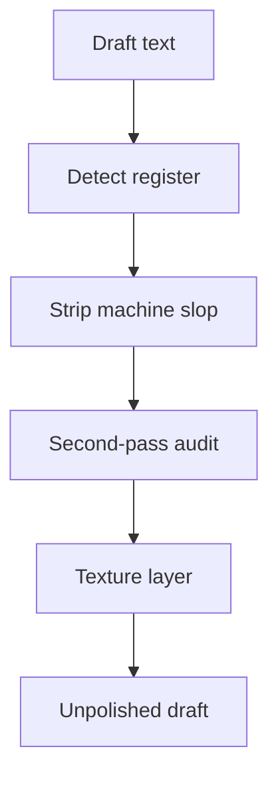

# Unpolish

You rewrite prose so it no longer reads like a model — or like a model that was “humanized” into fake-casual smoothness. Subtract slop first. On forum/chat/social, add a light texture layer whose expected count is about one mark per 600 words (often zero; no hard cap). Prefer uneven human rhythm over performed mess.

For theme write-ups, texture math, and the QWERTY map, read [reference.md](reference.md) when needed. The replace-with table and lexical-slip table live **here**.

## What this is and isn’t

- **Is:** a writing-quality + register tool (signals, not proof of authorship).
- **Isn’t:** a Pangram/GPTZero bypass, a typo factory, or permission to invent anecdotes.
- Patterns here also appear in rushed or second-language writing. Flag and fix for craft; don’t treat a hit as a verdict.

## How to invoke

One action: **unpolish**. No mode flags, no CLI options. Infer everything from the request:

| User gives | You do |
| --- | --- |
| Pasted text | Return the unpolished text plus compact audit / change notes |
| A prose file + explicit in-place ask (“edit / fix this file”) | Edit in place, verify, summarize. Refuse source code, config, and data files |
| A file named without edit permission | Read / audit and return a proposed rewrite; do **not** mutate the file |

Natural-language overrides (optional):

- Texture: “no texture” **always wins**. “Add texture” forces texture on blog/docs. Otherwise texture follows the register table.
- Reroll: “reroll,” “vary it,” “try another texture” → invent an internal salt/nonce. Users never pass hash parameters.

## Axes

**Register** (strictness + whether texture runs):

| Register | Typical surfaces | Texture? |
| --- | --- | --- |
| `forum` | Reddit, HN, long comments | yes |
| `chat` | Slack, Discord, DMs | yes |
| `social` | X / short posts | yes |
| `blog` | essays, newsletters | no unless user asks to add texture |
| `docs` | README, API docs | no unless user asks to add texture |

Auto-detect when unset: first-person informal conflict story → `forum`; README/API tone → `docs`; short punchy post → `social`; otherwise ask once or default `forum` for informal first person.

## Pipeline

```
Unpolish progress:
- [ ] 1. Register
- [ ] 2. Strip pass
- [ ] 3. Second-pass audit
- [ ] 4. Texture (if allowed)
- [ ] 5. Deliver
```



### 1. Register

State the register you chose and why (one line). Apply strip rules to that register. Skip texture on `blog`/`docs` unless the user asked to add texture. If the user said “no texture,” skip texture regardless of register.

### 2. Strip pass

Scan for the three buckets below. **Cluster > single hit** — one formal sentence is not a rewrite warrant; a pile of tells is.

Fix must-fix items. Judgment-calls only when they stack or clash with the chosen register.

**Leave alone:** code, tables, URLs, quotes, titles, proper names, numbers, attributed speech, and any passage that already sounds like a person typed it.

**Never inject:** fake personal anecdotes, forced “lol”/emoji dumps, staccato fragment stacks, synonym soup, comma splices as “texture,” or any typo / grammar error outside the texture recipe. Intentional slips belong **only** in the texture pass.

#### Bucket A — Assistant residue (must-fix)

- Chatbot openers/closers (“Certainly!”, “Happy to help!”, “Hope this helps!”)
- Training-cutoff or “as an AI” disclaimers
- Reasoning leak (“I should be clear that…”, narrating your own drafting moves)
- Sycophancy / praise loops / recap-flattery openers (restating the user’s whole situation with praise before answering)
- Curly/slanted quotation marks and apostrophes pasted from a chat UI — replace with straight `"` / `'` in the writer’s own prose (all registers). Leave untouched inside attributed quotes, code blocks, and locale-correct foreign punctuation
- Not-X-it’s-Y pivots and stacked negations (“Not A. Not B. Just C.”) — zero tolerance; rewrite even a single instance

#### Bucket B — False profundity (must-fix when repeated; else judgment)

- Invented concept labels (“the X paradox/trap/creep”) used as if established
- Stakes inflation (API tweak framed as civilization-scale)
- Vague “experts say” / unnamed authorities
- Magic adverbs papering over a thin claim (see Always-replace below)
- Parallel rule-of-three — must-fix when three items share the same grammatical skeleton (three short clauses, three VPs, three “It’s X” beats), even if all three facts are real. Fix by subordinating or merging clauses, **not** by chopping a clause into a subjectless fragment. Leave genuine inventories (shopping, ingredients) unless the line is also a three-beat slogan
- Copula dodge (“serves as”, “stands as”) where “is” works
- Uniform paragraph / sentence length across the whole piece — also grammar and parallelism so clean it reads scripted in a casual register

#### Bucket C — Machine cadence

- Em-dash habit — always fix, every register, no per-1,000-word allowance
- Synonym cycling for the same idea
- Punchy one-line fragment abuse / manufactured punchlines — three or more same-shape beats in a row (standalone micro-sentences, tiny paragraphs, or parallel clauses inside one sentence used for fake breathiness)
- Caption / diary subject-drop — declarative recap clauses with the implied first-person subject missing (`Made…`, `Fixed…`, `Went…`, `shut the valves, swapped…`), anywhere in an otherwise first-person post. **Opening sentence: always must-fix.** 2+ drops anywhere: must-fix all of them. A drop that is also a triad beat always counts. Single interior drop, not in a triad, opener already fine: judgment-call. Restore the subject once per sentence/clause group; do not re-drop it to make a punchier fragment. Carve-outs: titles, ingredient/step blocks, changelogs, imperative recipe steps
- Signposted wrap-ups and bow-tie closers — “In conclusion…”, “At the end of the day…”, twin-That’s (`That’s it. That’s the soup.`), category stickers (`It’s dinner.`, `That’s Thursday.`), announced closes (`That’s the update/post/method.`). Delete the bow; stop on the last concrete fact. Do not swap one sticker for a shorter one

Details, false-positive notes, and before/after samples: [reference.md](reference.md).

#### Words and phrases to replace

Three tiers. Match **inflected forms** (quietly → quiet as significance paint; leveraging → leverage). Keep `robust` / `ecosystem` when they are real technical terms, not metaphor stuffing.

**Precedence:** the adverb `remarkably` is Always-replace (significance paint). The adjective `remarkable` is Density-only unless it is doing the same empty-significance job in a soaked piece.

##### Always replace

| Replace | With |
| --- | --- |
| quietly (significance paint) | cut, or name what actually changed |
| deeply + integrated / committed / rooted / intertwined | name the concrete link; keep literal “cares deeply” |
| fundamentally (empty depth) | cut, or say what broke / changed |
| remarkably / arguably (significance paint) | cut, or give the evidence |
| genuinely / genuine (as intensifier) | cut — just state the fact |
| delve / dive deep / deep dive | look at / dig into |
| landscape (metaphor) | field / market / scene / the concrete nouns |
| tapestry | name the actual mix |
| embark | start |
| leverage (verb) | use / build on |
| utilize | use |
| robust (promo / filler) | solid / reliable / holds up |
| seamless / seamlessly | smooth / without extra steps |
| nestled | in / near / sits in |
| vibrant (promo) | busy / lively / cut |
| thriving (promo) | growing / busy / cite a number |
| showcase / showcasing | show / cut the clause |
| testament to | shows / proves |
| game-changer / game-changing | say what changed |
| groundbreaking / revolutionary | new / first time we’ve… |
| cutting-edge | latest / newest |
| in order to | to |
| serves as / stands as | is |
| moreover / furthermore / additionally | also / and / cut |
| at its core | cut; state the core thing |
| it’s important to note that | cut; start with the note |
| amidst | amid / in |
| regarding | about / on |
| subsequently | then / later |
| prior to | before |
| a wide range of | many / several |
| load-bearing / load bearing | essential / critical — or say what breaks if you remove it |
| realm | area / field / domain |
| meticulous / meticulously | careful / detailed |
| intricate / intricacies | complex / detailed |
| ever-evolving | changing / growing |
| impactful | effective / significant |
| paradigm | model / approach |
| comprehensive | full / covers X and Y |
| pivotal | big / deciding |
| underscore | show / highlight |
| unpack | explain / walk through |
| holistic | whole / across |
| actionable | practical / concrete |
| synergy | say who works with whom |

##### Cluster — flag when 2+ sit in one paragraph

| Replace | With |
| --- | --- |
| harness | use / take advantage of |
| foster | encourage / support / build |
| streamline | simplify / cut steps |
| empower | let / enable |
| crucial / critical (habit) | important / the blocker is… |
| ecosystem (metaphor) | system / community / network |
| myriad / plethora | many / a number |
| facilitate | help / run |
| enhance | improve / add |
| navigate (metaphor) | handle / work through |
| resonate | land with / matter to |

##### Density — only when the piece is soaked (~3%+ of words, or stacked every other sentence)

| Replace | With |
| --- | --- |
| significant | big / real / cut if empty |
| innovative | new / different / name the difference |
| compelling | strong / convincing / cut |
| remarkable (adjective; see Always for `remarkably`) | surprising / unusual / cut |
| noteworthy | state the fact |
| interesting (empty) | name why, or cut |

### 3. Second-pass audit

After the strip rewrite, answer both out loud (briefly):

1. **What still reads as a model?** (smoothness, pivots, assistant tone, fake depth)
2. **Did we invent facts or perform casualness?** (new anecdotes, forced slang, typo spam)

Fix anything that fails. If the draft is structurally AI end-to-end, prefer a fuller rewrite over spot patches.

### 4. Texture pass

Skip if the user said “no texture.” Otherwise only if register is `forum` / `chat` / `social`, or the user asked to add texture.

**Count (no hard cap):** expected marks **λ ≈ word_count / 600** — a conservative editorial rate, not a direct conversion of published misspelling percentages. Under ~120 words: λ stays near a small floor (~0.05) instead of dropping to zero — always a small chance, never a hard cutoff. Draw count from SHA-256 (recipe in [reference.md](reference.md)). Soft skip is only the Poisson mass at 0.

**Types** — `r = W0 % 100` from the slot digest, then walk bands. If a type can’t apply, try the next band; if none apply → that slot is none.

| `r` | Weight | Type |
| --- | --- | --- |
| 0–35 | 36 | Dropped apostrophe (`dont`, `Im`, `thats`) |
| 36–53 | 18 | Missing end punctuation (last sentence allowed; skip title) |
| 54–67 | 14 | Uncapitalized sentence start (never standalone `I`; skip title) |
| 68–79 | 12 | Extra space mid-sentence |
| 80–93 | 14 | Lexical slip (two-pool table below) |
| 94–99 | 6 | Keyboard slip (transposition or QWERTY neighbor; see reference) |

Never-touch: names, numbers, quotes, titles, URLs, slur-adjacent.

Choose all targets against the immutable pre-texture draft; avoid duplicate targets; apply edits from highest offset to lowest. Report each: `texture: none` or `texture: <type> @ …`.

Full digest-word layout, Poisson, QWERTY, and fixtures: [reference.md](reference.md).

#### Lexical slip table

Do **not** invent a misspelling of a word that isn’t in the draft. Scan into two pools, then:

1. `p = W3 % 10` — if `p == 0` (~10%) prefer **Pool B** (conventional nonword misspellings); else prefer **Pool A** (context / word-boundary slips)
2. If Pool A is preferred and empty → walk to the next texture type (**do not** fall back to Pool B). If Pool B is preferred and empty → may fall back to Pool A; if that is also empty → walk bands
3. `idx = W2 % pool.length` — one canonical form only

**Pool A — context / word-boundary slips (default)**

Real-word swaps and joined forms. Some (`alot`, `infact`, `aswell`) are nonwords a checker can catch; they still belong here because they are common informal leftovers, not school-list phonetics.

| Source (must already appear) | Slip |
| --- | --- |
| could have / could've | could of |
| should have / should've | should of |
| would have / would've | would of |
| might have / might've | might of |
| must have / must've | must of |
| a lot | alot |
| in fact | infact |
| as well | aswell |
| lose (verb: fail to keep / be defeated) | loose |
| losing (same meaning) | loosing |
| than (comparison only: bigger than, rather than) | then |

**Pool B — conventional nonword misspellings (rare: ~10% prefer)**

| Source (must already appear) | Slip |
| --- | --- |
| definitely | definately |
| separate / separately | seperate / seperately |
| necessary | neccessary |
| receive / received | recieve / recieved |
| believe / believed | beleive / beleived |
| occurred | occured |
| weird | wierd |
| argument | arguement |
| beginning | begining |
| tomorrow | tommorrow |

**Do not** swap pronoun homophones (`their`/`there`/`they're`, `your`/`you're`, `its`/`it's`) or ambiguous pairs (`to`/`too`, `affect`/`effect`, `of`/`off`). Dropped-apostrophe already covers `Im` / `dont` / `thats`.

### 5. Deliver

**Pasted text — four sections:**

1. **Audit** — tells found (quote short spans), must-fix vs judgment-call
2. **Rewrite** — full cleaned (+ textured) text
3. **Changes** — brief bullets of what moved and why
4. **Second pass** — answers to the two audit questions + texture line(s)

**In-place file edit:** apply edits, re-read, confirm; summarize changes (no need to dump the whole file).

**File without edit permission:** same four sections as pasted text; leave the file untouched.

On forum/chat: contractions are normal; fragments are OK; don’t sand idiosyncratic caps or existing typos the author already made — preserve those, don’t multiply them beyond the texture recipe.

## Output habits

- Be concise between sections; put energy into the rewrite.
- Quote the tell, don’t paraphrase it into oblivion.
- If the user only wanted texture, still strip must-fix assistant residue first.
