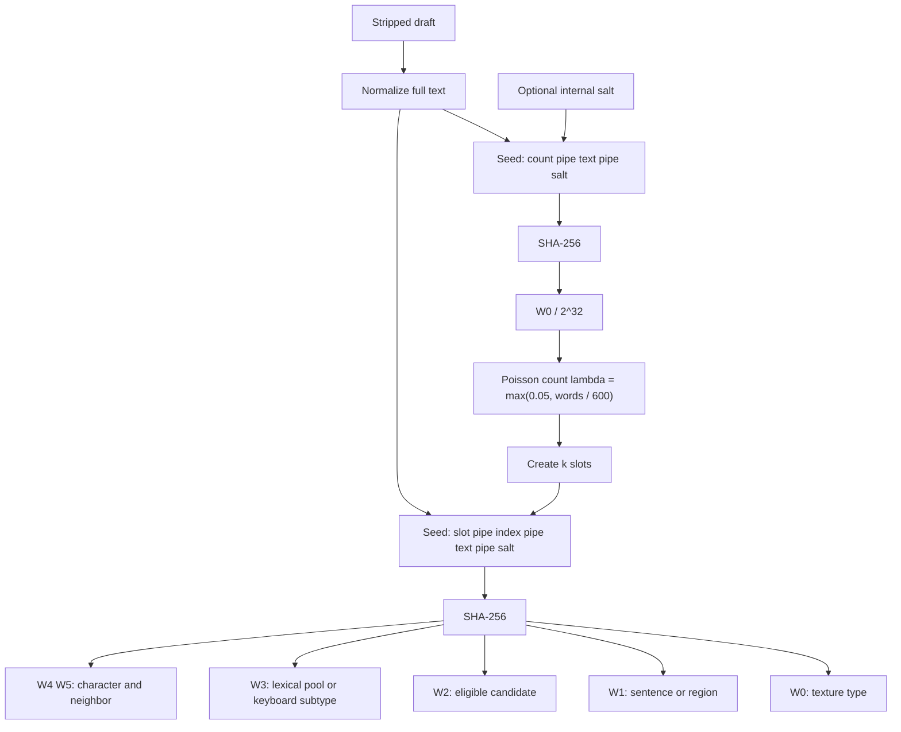

# Unpolish reference

Progressive disclosure for the `unpolish` skill. Read sections as needed.

The **replace-with table**, **lexical-slip table**, and **hash recipe** live in [SKILL.md](SKILL.md). This file holds theme write-ups, the QWERTY map, and checked fixtures.

---

## Theme catalog

Severity: **must-fix** vs **judgment-call**. Clusters beat lone hits.

### A — Assistant residue

#### Chatbot openers and closers
**Must-fix.** “Certainly!”, “Of course!”, “Happy to help!”, “Hope this helps!”, “Let me know if you need anything else.”

False positive: a human sincerely offering help once at the end of a support reply — still cut it on forum posts; keep only if the genre is customer support and the user wants it.

Cut the chatbot opener **and** the advice-setup preamble. Do not swap one assistant framing for another (“Here's how I'd play it”).

#### Cutoff / identity disclaimers
**Must-fix.** “As an AI…”, “my training data…”, “I don’t have personal experience but…”

#### Reasoning leak
**Must-fix.** Narrating deliberation instead of stating the point: “I should be clear that…”, “What I want to be precise about is…”, “Let me unpack…”

False positive: a person correcting themselves mid-thought (“wait, that’s not right —”) is human; keep those.

#### Sycophancy / recap-flattery
**Must-fix.** “Great question!”, “You’re absolutely right to worry…” Also: restating the user’s whole story with praise before answering — just answer.

#### Curly/slanted quotes
**Must-fix.** Curly/slanted quotation marks and apostrophes (`“ ” ‘ ’`) pasted from a chat UI — replace with straight `"` / `'` in the writer’s own prose. All registers. Leave untouched inside attributed quotes, code blocks, and locale-correct foreign punctuation.

#### Not-X-it’s-Y / stacked negation
**Must-fix.** Zero tolerance — even a single instance gets rewritten. “It's not about the dishes. It's about respect. Not laziness. Not forgetfulness. A pattern.” → state the positive claim.

---

### B — False profundity

#### Invented concept labels
**Judgment-call** once; **must-fix** when the piece invents several “X paradox / trap / creep / vacuum” labels and treats them as established.

#### Stakes inflation
**Must-fix** when a small interpersonal fight is framed as civilization-scale.

#### Vague attribution
**Must-fix.** “Experts say”, “studies show”, “many people believe” with no source — especially when used as a cudgel.

#### Magic adverbs
**Always-replace** when they prop up empty claims: quietly, deeply (significance collocations), fundamentally, remarkably, arguably. See SKILL.md Always-replace table. The adjective `remarkable` is Density-tier unless the piece is soaked.

#### Rule-of-three / parallel skeleton
**Must-fix** when three items share the same grammatical shape in one sentence or three stacked beats — even if all three facts are real. A filler third is an easy hit; a clean `A, B, and C` slogan is the same tell.

Fix by changing the relationship between the clauses (subordinate one to another, or merge two and let the third stand as its own full sentence with its own subject). Do **not** lop the front off a clause to make a fragment — that trades a 3-beat tell for a 2-beat staccato tell, and often creates a fresh subject-drop.

Leave **bare-noun** inventories (shopping lists, ingredients) unless the line is also a three-beat slogan. Empty significance tails (`that matters`, `that isn't pretending to be X`) are not inventories — cut the tail or name the concrete spec.

Before: `It's metal, it clicks off, and it doesn't leak onto the counter.`  
After: `It's metal, and it clicks off before it can leak onto the counter.`

#### Copula dodge
**Must-fix** when “serves as / stands as / marks / represents” replaces a plain “is”.

#### Uniform rhythm / over-clean chat register
**Judgment-call** — flag when almost every sentence is the same length and every paragraph is a similar block. Also **must-fix** on forum/chat/social when grammar, parallelism, and punctuation are spotless and every turn of thought is balanced (reads scripted in a casual register).

Fix: merge two short paragraphs, or split a metronome run. On chatty registers, vary with a fragment, a shorter blunt sentence, or uneven paragraph lengths. Do **not** inject comma splices, typos, or missing punctuation here — those belong exclusively in the texture pass. Don’t convert the whole piece into one-line punches (that’s punchy fragment abuse).

---

### C — Machine cadence

#### Em-dash habit
**Must-fix** in every register — no per-1,000-word allowance. Prefer comma, period, or two sentences.

#### Synonym cycling
AI rotates synonyms to avoid repeating a word: "developers… engineers… practitioners… builders" in the same paragraph. Human writers repeat the clearest word. If the same noun or verb appears three times and that's the right word, keep all three. Forced variation reads as thesaurus abuse.

#### Punchy fragment abuse / manufactured punchlines
**Must-fix** when three or more same-shape beats land in a row — standalone micro-sentences, tiny paragraphs, or parallel clauses inside one sentence engineered so every beat is a quotable closer. One short sentence that lands a point is fine; a drumroll of identical shapes is the tell. `She lied. Openly. To my face. Twice.` → `She lied to my face. Twice.`

#### Caption / diary subject-drop
**Must-fix** on forum/chat/social when a declarative recap clause drops the implied first-person subject (`Made…`, `Fixed…`, `Went…`, `shut the valves, swapped…`) in a first-person post.

Severity:

- **Opening sentence: always must-fix**, even as the only drop.
- **2+ dropped-subject clauses → must-fix all of them.**
- A drop that is also one beat of a triad always counts toward the cluster.
- Single interior drop, not in a triad: **judgment-call**.

Fix: restore the subject once per sentence/clause group. Do **not** re-drop it two words later to make a punchier fragment.

Carve-outs: titles, ingredient/step blocks (`Preheat to 425.`), changelogs, imperative recipe steps. Do not invent `I` on third-person narration.

Before: `Shut the valves, swapped the cartridge, put the handle back on.`  
After: `I shut the valves and swapped the cartridge. Then the handle went back on.`

#### Signposted endings / bow-tie closers
**Must-fix.** Classic signposts (“In conclusion,” “At the end of the day,” “The bottom line is”) plus caption-style bows that **label the post** after the facts already landed:

- Twin-That’s: `That's it. That's the soup.`
- Category sticker: `It's dinner.` / `That's Thursday.` / `That's the job.`
- Announced close: `That's the update/post/method.`

Fix: delete the bow. Stop on the last concrete action or fact. Do **not** swap one sticker for a shorter one (`That's the soup` → `It's Tuesday and I had a can` is still a bow if that line only restates the topic as a noun).

Leave a last line that is new information (`The sink is quiet now.` / `I just didn't want to go twice.`) if it is not restating the topic as a label.

---

## Texture policy

### Budget

| Rule | Value |
| --- | --- |
| Expected marks | λ ≈ max(0.05, word_count / 600) (Poisson draw; **no hard cap**) |
| Min length | no hard cutoff — λ floor ≈ 0.05 keeps a small chance even for very short drafts |
| Skip registers | `blog`, `docs` unless user asks to add texture |
| Absolute skip | user said “no texture” |
| Soft skip | only Poisson P(k=0) — no stacked random gate |
| Forbidden targets | names, numbers, quotes, titles, URLs, slur-adjacent |

Example λ:

- ~20 words → λ ≈ 0.05 (floor) → almost always 0, rare 1
- 400 words → λ ≈ 0.67 → often 0, sometimes 1, rarely 2
- 600 words → λ ≈ 1.0 → mix of 0 / 1 / 2
- 1000 words → λ ≈ 1.67 → commonly 1–2, sometimes 0 or 3, rarely 4+

### Types (weighted CDF)

From each slot’s SHA-256 digest: `r = W0 % 100`

| `r` | Weight | Type | How to apply |
| --- | --- | --- | --- |
| 0–35 | 36 | Dropped apostrophe | `W1` → sentence; `W2` → eligible contraction (`don't`→`dont`, `I'm`→`Im`, `that's`→`thats`). Prefer these over ambiguous `it's`→`its`. |
| 36–53 | 18 | Missing end punctuation | Eligible = paragraph-final sentences ending in `.` or `?`. `W1 %` over that pool; remove the mark. Empty (or all claimed) → `texture: none` — **do not walk**. |
| 54–67 | 14 | Uncapitalized sentence start | `W1` → eligible sentence; lowercase first letter (never standalone `I`). |
| 68–79 | 12 | Extra space | `W1` → sentence; `W2` → which single space becomes two (`I  think`). |
| 80–93 | 14 | Lexical slip | Two pools in SKILL.md; `W3 % 10` and `W2` — see below. |
| 94–99 | 6 | Keyboard slip | `W3` picks subtype; `W2`/`W4`/`W5` pick word/char/neighbor — see below. |

If the chosen type can’t apply cleanly, walk to the next weight band; if none apply → that slot is `texture: none`.

### Lexical slip — two pools

Full table: [SKILL.md](SKILL.md). Summary of the pick:

1. Scan the stripped draft into **Pool A** (context / word-boundary) and **Pool B** (conventional nonword misspellings).
2. Meaning gates before a form enters Pool A:
   - `lose` / `losing` only when the verb means “fail to keep / be defeated” (not “not tight”)
   - `than` only in a comparison (`bigger than`, `rather than`)
3. Prefer pool: `p = W3 % 10`. If `p == 0` (~10%) prefer Pool B; else prefer Pool A.
4. Empty Pool A (when preferred) → **walk to next texture type** (no fallback to Pool B). Empty Pool B (when preferred) → may fall back to Pool A; both empty → walk bands.
5. `idx = W2 % pool.length` — one canonical slip.

Do **not** hash-pick from one combined list. Do **not** swap pronoun homophones.

### Sentence pick

- Split on `.` `?` `!` into sentences; trim empties
- Eligible = body sentences (skip mostly-quote or URL-heavy sentences)
- **Missing end punctuation:** eligible = paragraph-final sentences ending in `.` or `?` (blank line or end of draft). `W1 %` over that pool only. Empty or all claimed → that slot is `texture: none` (no walk to another type)
- Index = `W1 % eligible_count` (from that slot’s digest)
- When count ≥ 2, skip a sentence already claimed by an earlier slot; if none left for this type, walk bands (except missing-end-punct → none)

### Keyboard slip

Two subtypes (from `W3 % 2`):

| `W3 % 2` | Subtype | Example |
| --- | --- | --- |
| 0 | Adjacent-letter **transposition** | `the`→`teh`, `and`→`adn` |
| 1 | QWERTY-neighbor **substitution** | `should`→`shoukd` |

Shared picks:

1. Eligible words in the chosen sentence: length ≥ 3, not never-touch → `W2 % count`
2. Interior character index → `W4 % (len - 2)`, applied at position `1 + that`
3. Neighbor / direction → `W5`

For transposition: swap the chosen interior letter with the next letter (if at last interior, swap with previous).

For substitution: replace the chosen letter with a QWERTY neighbor from the map; neighbor index = `W5 % neighbor_count`.

| Key | Neighbors (use one) |
| --- | --- |
| a | s q w |
| b | v g h n |
| c | x d f v |
| d | s e r f c x |
| e | w r d s |
| f | d r t g v c |
| g | f t y h b v |
| h | g y u j n b |
| i | u o k j |
| j | h u i k n m |
| k | j i o l m |
| l | k o p |
| m | n j k |
| n | b h j m |
| o | i p l k |
| p | o l |
| q | w a |
| r | e t f d |
| s | a w e d z x |
| t | r y g f |
| u | y i j h |
| v | c f g b |
| w | q e a s |
| x | z s d c |
| y | t u h g |
| z | a s x |

### Collision handling

1. Choose **all** slot targets against the immutable pre-texture draft (character offsets or stable sentence+token indices).
2. Reject a target that overlaps an earlier slot’s span; re-walk type bands for that slot if needed.
3. Apply surviving edits from **highest offset to lowest** so earlier applications do not shift later indices.

---

## Hash recipe (SHA-256)

Normalize / seeds / digest: [SKILL.md](SKILL.md). This section keeps the word-use table, mermaid, and fixtures.



Word use by type:

| Type | W0 | W1 | W2 | W3 | W4 / W5 |
| --- | --- | --- | --- | --- | --- |
| Dropped apostrophe | type band | sentence | contraction | — | — |
| Missing punctuation | type band | sentence | — | — | — |
| Lowercase start | type band | sentence | — | — | — |
| Extra space | type band | sentence | which space | — | — |
| Lexical slip | type band | (optional region) | pool index | pool prefer `W3%10` | — |
| Keyboard slip | type band | sentence | word | subtype `W3%2` | char / neighbor |

### Draw count (Poisson)

```
λ = max(0.05, word_count / 600)
u = W0_count / 2^32
k = smallest m ≥ 0 with cdf_poisson(m; λ) ≥ u
```

No max on `k`. Soft skip is only when `k = 0`.

Rough mental cdf for small λ:

- λ ≈ 1: P(0)≈0.37, P(1)≈0.37, P(2)≈0.18, P(3)≈0.06, P(4+)≈0.02
- λ ≈ 1.67: P(0)≈0.19, P(1)≈0.31, P(2)≈0.26, P(3)≈0.14, P(4+)≈0.10

### Checked fixtures

UTF-8 SHA-256, big-endian words. Recompute to verify.

**Fixture 1 — often zero at λ≈1**

- `text` = `fixture a short forum draft about a roommate and dishes`
- `count_seed` = `count|fixture a short forum draft about a roommate and dishes|`
- digest prefix `39894103…` → `W0 = 965296387` → `u ≈ 0.22475`
- At λ = 1.0 → **k = 0**. At λ = 1.67 → **k = 1**.

**Fixture 2 — multi-mark at long λ**

- `text` = `fixture b longer draft` + 500 spaced `x` tokens (see verification scripts / recompute from seed shape `count|fixture b longer draft x x … x|`)
- digest prefix `a5472dc4…` → `W0 = 2772905412` → `u ≈ 0.64562`
- At λ = 1.0 → **k = 1**. At λ = 1.67 → **k = 2**.

**Fixture 3 — lexical context pool (not rare nonword)**

- `slot_seed` = `slot|1|i definitely could have handled that argument better than i did|`
- digest prefix `b28e8162…` → `W0 % 100 = 82` → lexical band (80–93)
- `W3 % 10 = 3` → prefer **Pool A** (context / word-boundary). Eligible sources include `could have`, `than` (comparison), etc. If Pool A were empty on this roll, walk to another type — do **not** fall back to Pool B.

**Fixture 4 — type band check (extra space)**

- `slot_seed` = `slot|0|fixture a short forum draft about a roommate and dishes|`
- digest prefix `2b20b7b6…` → `W0 % 100 = 70` → extra-space band (68–79)

### Report

Always report: `texture: none` or one line per mark, e.g. `texture: dropped_apostrophe @ sentence 4`, `texture: lexical_slip could_of @ …`, `texture: keyboard_slip transposition @ …`.

---

## Register cheat sheet

| Cue in the draft | Prefer |
| --- | --- |
| AITA / WIBTA / “am I wrong” / subreddit tone | `forum` |
| @-mentions, 1–3 short paragraphs, thread energy | `social` |
| Slack-like, no title, rapid context | `chat` |
| H2 headers, “Overview”, feature lists | `docs` |
| Newsletter / essay with a thesis | `blog` |
