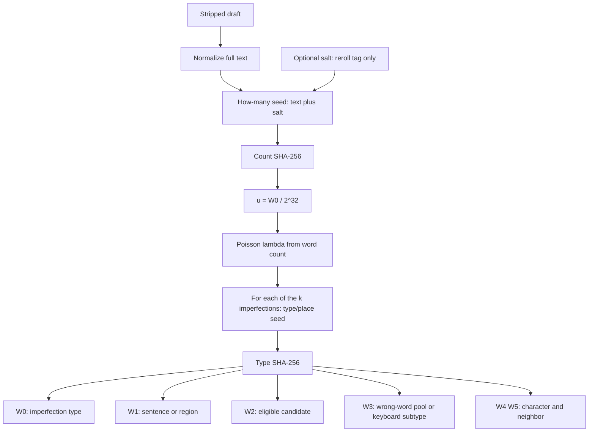

# Imperfections (read only when the user asked for imperfections)

Sparse hash-drawn imperfections. **λ ≈ max(0.05, word_count / 600)**. Soft skip is Poisson P(k=0) or no eligible type. Use **SHA-256 only** (no wall-clock, no djb2), computed via an actual code tool. When the user says “reroll” / “vary it,” invent an internal salt (`reroll1`, their phrase, …); otherwise `salt` is empty.

Never-touch: names, numbers, quotes, titles, URLs, slur-adjacent.

## Hash recipe

1. **Normalize** the stripped rewrite: lowercase, collapse whitespace runs to a single space, keep the full string → `text`
2. **Seeds:** `count_seed = "count|" + text + "|" + salt`; per slot `s` (0-based): `slot_seed = "slot|" + str(s) + "|" + text + "|" + salt`
3. **Digest words:** `digest = SHA-256(UTF-8 bytes of seed)` (32 bytes); `W0…W5` = uint32 big-endian from `digest[0:4]`, `[4:8]`, … `[20:24]`
4. **Poisson count:** `u = W0_count / 2^32` from `count_seed`; `k` = smallest `m ≥ 0` with `cdf_poisson(m; λ) ≥ u`
5. For each slot `s` in `0 .. k-1`: hash `slot_seed` → words; type draw per Types below; apply W1–W5. Report `imperfection: none` or `imperfection: <type> @ …`

## Types (weighted CDF)

Weights below sum to **100**. Per slot, drop types with an empty or already-claimed candidate set; `S = sum(remaining weights)`; `r = W0 % S` on that short tape in table order. Empty list → `imperfection: none`. Misspelling / wrong word is eligible if Pool A **or** B has a source in the draft.

| Weight | Type | How to apply |
| --- | --- | --- |
| 28 | Misspelling / wrong word | Two pools below; `W3 % 10` and `W2`. Report id: `wrong_word`. |
| 24 | Dropped apostrophe | `W1` → sentence; `W2` → eligible contraction (`don't`→`dont`, `I'm`→`Im`, `that's`→`thats`). Prefer these over ambiguous `it's`→`its`. |
| 18 | Missing end punctuation | Eligible = paragraph-final sentences ending in `.` or `?`. `W1 %` over that pool; remove the mark. |
| 14 | Uncapitalized sentence start | `W1` → eligible sentence; lowercase first letter (never standalone `I`). |
| 12 | Extra space | `W1` → sentence; `W2` → which single space becomes two (`I  think`). |
| 4 | Keyboard slip | `W3` picks subtype; `W2`/`W4`/`W5` pick word/char/neighbor. |

Word use by type:

| Type | W0 | W1 | W2 | W3 | W4 / W5 |
| --- | --- | --- | --- | --- | --- |
| Misspelling / wrong word | type band | (optional region) | pool index | pool prefer `W3%10` | — |
| Dropped apostrophe | type band | sentence | contraction | — | — |
| Missing punctuation | type band | paragraph-final index | — | — | — |
| Lowercase start | type band | sentence | — | — | — |
| Extra space | type band | sentence | which space | — | — |
| Keyboard slip | type band | sentence | word | subtype `W3%2` | char / neighbor |

## Misspelling / wrong word — two pools

Do **not** invent a misspelling of a word that isn’t in the draft. Scan into two pools, then:

1. `p = W3 % 10` — if `p == 0` (~10%) prefer **Pool B**; else prefer **Pool A**
2. If the preferred pool is empty, use the other; if both empty, this type was not eligible (should not have been on the short tape)
3. `idx = W2 % pool.length` — one canonical form only (one row per source type that appears; do **not** give each occurrence of `to` its own vote)
4. Apply that slip once (first occurrence in the chosen region)

**Pool A — wrong word / mix-up** (`W3 % 10 ≠ 0`, ~90%)

| Source (must already appear) | Slip |
| --- | --- |
| could have / could've | could of |
| should have / should've | should of |
| would have / would've | would of |
| might have / might've | might of |
| must have / must've | must of |
| a lot | alot |
| in fact | infact |
| as well | aswell |
| lose (verb: fail to keep / be defeated) | loose |
| losing (same meaning) | loosing |
| than (comparison only: bigger than, rather than) | then |
| their | there |
| there | their |
| they're | their |
| your | you're |
| you're | your |
| its | it's |
| it's | its |
| to | too |
| too | to |
| affect | effect |
| effect | affect |
| of | off |
| off | of |

**Pool B — conventional nonword misspellings** (`W3 % 10 == 0`, ~10%)

| Source (must already appear) | Slip |
| --- | --- |
| definitely | definately |
| separate / separately | seperate / seperately |
| necessary | neccessary |
| receive / received | recieve / recieved |
| believe / believed | beleive / beleived |
| occurred | occured |
| weird | wierd |
| argument | arguement |
| beginning | begining |
| tomorrow | tommorrow |

Dropped-apostrophe already covers `Im` / `dont` / `thats` (prefer those contractions over wrong-word `it's`↔`its` when both could apply).

## Sentence pick

- Split on `.` `?` `!` into sentences; trim empties
- Eligible = body sentences (skip mostly-quote or URL-heavy sentences)
- **Missing end punctuation:** eligible = paragraph-final sentences ending in `.` or `?` (blank line or end of draft). `W1 %` over that pool only
- Index = `W1 % eligible_count`

## Keyboard slip

Two subtypes (from `W3 % 2`):

| `W3 % 2` | Subtype | Example |
| --- | --- | --- |
| 0 | Adjacent-letter **transposition** | `the`→`teh`, `and`→`adn` |
| 1 | QWERTY-neighbor **substitution** (same-row only) | `should`→`shuild` |

Shared picks:

1. Eligible words in the chosen sentence: length ≥ 3, not never-touch → `W2 % count`
2. Interior character index → `W4 % (len - 2)`, applied at position `1 + that`
3. Neighbor / direction → `W5`

For transposition: swap the chosen interior letter with the next letter (if at last interior, swap with previous).

For substitution: replace the chosen letter with a **same-row horizontal** QWERTY neighbor; neighbor index = `W5 % neighbor_count`.

| Key | Neighbors (left/right only) |
| --- | --- |
| a | s |
| b | v n |
| c | x v |
| d | s f |
| e | w r |
| f | d g |
| g | f h |
| h | g j |
| i | u o |
| j | h k |
| k | j l |
| l | k |
| m | n |
| n | b m |
| o | i p |
| p | o |
| q | w |
| r | e t |
| s | a d |
| t | r y |
| u | y i |
| v | c b |
| w | q e |
| x | z c |
| y | t u |
| z | x |
